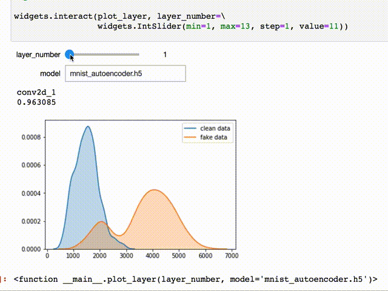

## Unsupervised adversarial attack detection in autoencoders activations and Reconstruction Error with Subset Scanning

**Example of subset scanning scores across layers of an Autoencoder for adversarial BIM noise $ \epsilon = 0.01$**. In the top of the graph we can see Subset score distributions per nodes in layer (blue distribution of subset scores for clean images ($C$) or expected distribution, orange noised samples $A_t$.
    The purple structure correspond to convolutional layers at the Encoder, red layers for the Decoder. 
The highest mutual information exchange with the adversarial input happens on the first layers (convolutional and maxpooling), this is why we see greatest divergence in both $C$ and $A_t$ subset scores distributions. Moving forward to the bottleneck layer, due to AE properties, the AE abstracts basic representations of the images, loosing subset scanning power due to the autoencoder is mapping the new sample to the expected distribution, you can see an almost overlap of distribution in *conv_2d_7*.

(a) **ROC curves for BIM and FGSM noise attacks** as compared to the scores from test sets containing all natural images for layer *Conv2d_1*. (b) **Distribution of subset scores** for test sets of images over *Conv2d_1*. Test sets containing all natural images had lower than scores than test sets containing noised images. Higher proportion of noised images resulted in higher scores.

## This Repo contains code for:
- Running Subset Scanning across all layers of several pretrained autoencoders [Jupyter Notebook](https://github.com/usersubsetscan/autoencoder_anomaly_subset/blob/master/run_subset_scanning_over_AE_ICLR_public.ipynb)
- Running Subset Scanning over the reconstruction error [Jupyter Notebook](https://github.com/usersubsetscan/autoencoder_anomaly_subset/blob/master/run_subset_scanning_over_AE_ICLR_public.ipynb)
- Generate Adversarial attacks used in the paper [Jupyter Notebook](https://github.com/usersubsetscan/autoencoder_anomaly_subset/blob/master/generate_adv_noise_ART.ipynb)
- Pretrained Autoencoders and CNNs [Models .h5](https://github.com/usersubsetscan/autoencoder_anomaly_subset/tree/master/models)
- Adversarial generated samples for three different attacks [npy files](https://github.com/usersubsetscan/autoencoder_anomaly_subset/tree/master/inputdata)
- Dependency list [requirements.txt](https://github.com/usersubsetscan/autoencoder_anomaly_subset/blob/master/requirements.txt)

### Animation over each layer to see how the subset scanning score distributions.

